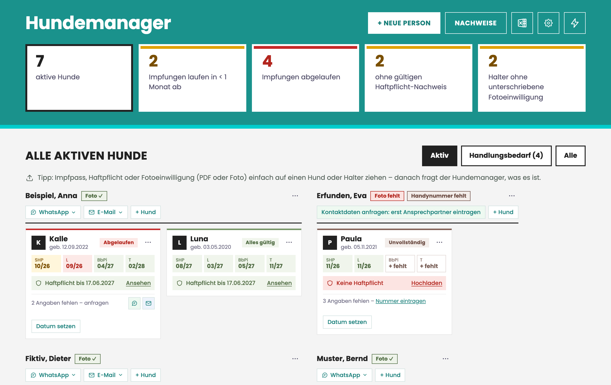
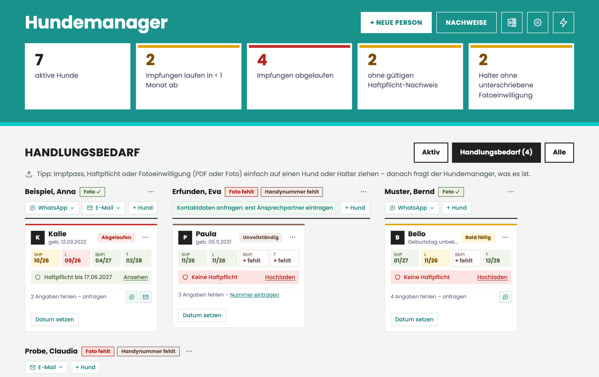
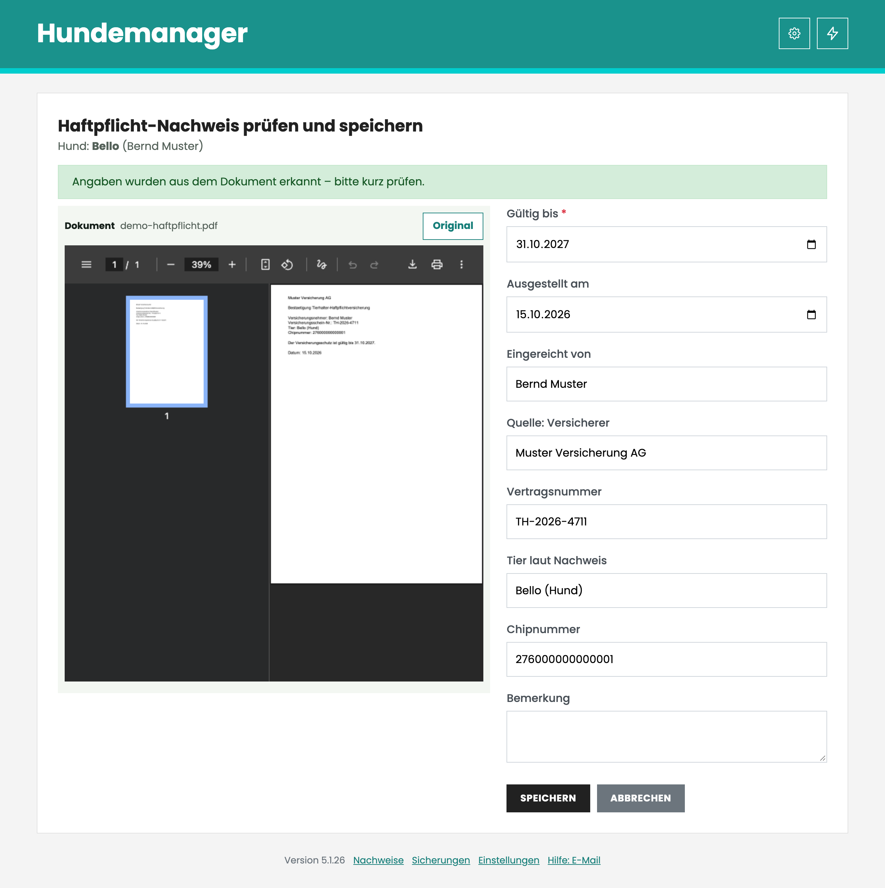
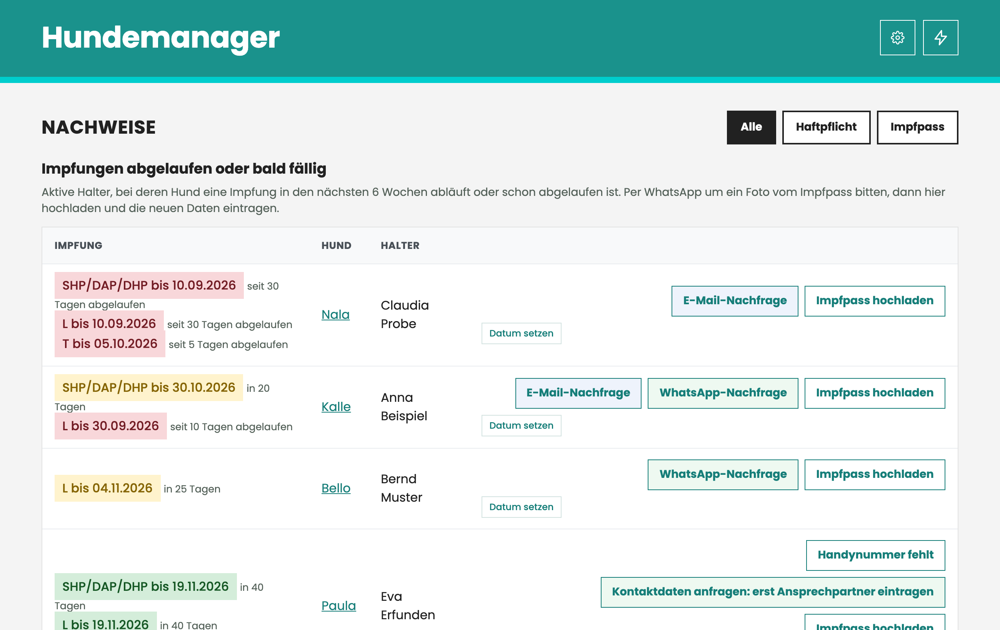
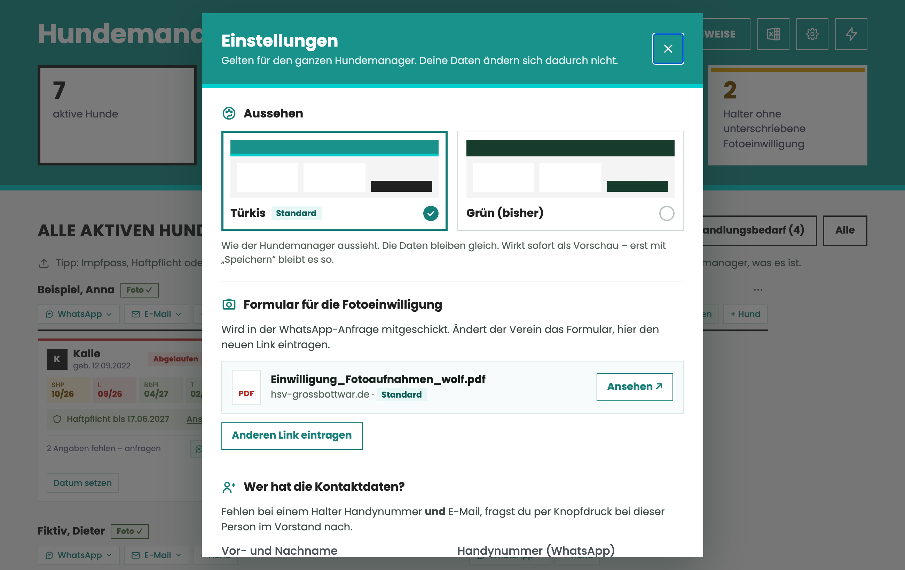

# 🐕 Hundemanager

**Hunde, Halter, Impfungen und Haftpflicht für den Hundeverein – auf einen Blick, ohne Zettelwirtschaft.**

Der Hundemanager läuft auf einem ganz normalen Windows-PC im Browser. Er zeigt sofort, bei welchem
Hund etwas fehlt oder bald abläuft, und schreibt die Nachfrage an den Halter gleich selbst vor –
per WhatsApp oder E-Mail, mit einem Klick. So bleibt mehr Zeit für die Hunde und weniger für Listen.

> 💡 **Die Idee und die erste Version stammen von [Saskia](https://github.com/saskia190)**, die damit die
> Hunde im [HSV Großbottwar e.V.](https://www.hsv-grossbottwar.de/) verwaltet – für diesen Verein ist der Hundemanager entstanden. Dieses Repository baut auf ihrer Version auf
> ([Ausgangsstand](https://github.com/kai-osthoff/hundemanager/commit/7dbcd27)) und entwickelt sie weiter.

Alle Screenshots zeigen erfundene Beispieldaten.

---

## Was man damit Cooles machen kann

### Auf einen Blick sehen, wo es hakt

Oben stehen die Zahlen, die zählen: wie viele Impfungen bald ablaufen oder schon abgelaufen sind,
wer noch keinen gültigen Haftpflicht-Nachweis hat, wer die Fotoeinwilligung nicht unterschrieben hat.
**Ein Klick auf eine Kachel** filtert die Übersicht genau auf diese Hunde.

Jede Hundekarte zeigt die vier Impfungen (SHP, L, BbPi, T) in Ampelfarben, den Haftpflicht-Stand und
was noch fehlt. Rot ist abgelaufen, Gelb läuft bald ab, Grün passt.

### „Handlungsbedarf“: nur das, was heute zu tun ist

Die Ansicht **Handlungsbedarf** blendet alles aus, was in Ordnung ist. Übrig bleibt die To-do-Liste.
Wer schon angeschrieben wurde, bekommt eine **Wiedervorlage** (Standard: 14 Tage) und verschwindet
bis dahin aus der Liste – am Termin taucht der Hund von selbst wieder auf, falls noch nichts kam.
Sind alle Angaben da, erledigt sich die Wiedervorlage automatisch.

### Nachfragen mit einem Klick – per WhatsApp oder E-Mail

Fehlt etwas, steht auf der Karte „2 Angaben fehlen – anfragen“. Ein Klick öffnet WhatsApp Web (oder das
E-Mail-Programm) mit einer fertigen, freundlichen Nachricht an den Halter, zum Beispiel:

> Hallo Anna,
>
> für Kalle fehlen mir noch ein paar Angaben:
> • Impfung SHP/DAP/DHP: läuft am 30.10.2026 ab
> • Impfung L: abgelaufen am 30.09.2026
>
> Schick mir einfach ein Foto vom Impfpass bzw. den Nachweis hier per WhatsApp.
>
> Danke und viele Grüße
> Saskia

Abgeschickt wird immer von dir selbst – der Hundemanager verschickt nie etwas im Hintergrund.
Fehlen bei einem Halter Handynummer **und** E-Mail, fragt ein Knopf die Kontaktdaten beim
zuständigen Vorstandsmitglied an.

### Nachweise einfach hineinziehen – die Angaben füllen sich selbst aus

PDF oder Foto vom Versicherungsnachweis, Impfpass oder der Fotoeinwilligung einfach **per
Drag-and-Drop auf den Hund oder Halter ziehen**. Der Hundemanager fragt kurz „Was ist das?“ und
legt das Dokument richtig ab.

- **Haftpflicht-PDFs** werden gelesen: Versicherer, Vertragsnummer, gültig bis, Tier und Chipnummer
  stehen schon im Formular. Kurz prüfen, speichern, fertig.
- **Impfpass-Fotos** werden automatisch gedreht und zugeschnitten. Der Hundemanager schlägt die
  Impfdaten vor und erkennt die Aufkleber gängiger Impfstoffe. Ist ein Foto unscharf oder
  abgeschnitten, sagt er das – und bietet gleich eine Nachricht an den Halter an, ein neues zu schicken.
- Ein altes Foto überschreibt nie eine neuere Impfung.

### Alle Nachweise an einem Ort – mit Erinnerung, bevor etwas abläuft

Unter **Nachweise** stehen alle Impfungen, die abgelaufen sind oder in den nächsten 6 Wochen ablaufen,
jeweils mit WhatsApp-/E-Mail-Nachfrage und „Impfpass hochladen“. Darunter: welche
Haftpflicht-Nachweise bald erneuert werden müssen und die vollständige Historie aller eingereichten
Dokumente – wer hat wann was eingereicht, von welcher Versicherung, gültig bis wann.

### Fotoeinwilligung je Halter

Wer der Veröffentlichung von Fotos zugestimmt hat, steht direkt am Halter („Foto ✓“ oder „Foto fehlt“).
Fehlt sie, schickt ein Klick den Link zum Formular per WhatsApp. Ein Widerruf wird vermerkt – danach
wird nicht mehr gefragt.

### Einstellungen, Excel und Farbschema

Farbschema (Türkis im Look der Vereinsseite oder das bisherige Grün), Formular-Link, Ansprechpartner
im Vorstand und Wiedervorlage-Frist lassen sich ohne Technikkenntnisse einstellen.
Die komplette Liste gibt es jederzeit als **Excel-Datei**.

---

## Warum sich das lohnt

**Zeit sparen**

- Kein Durchsuchen von Listen und Ordnern: Die Übersicht rechnet selbst aus, was abläuft.
- Keine Nachricht mehr von Hand tippen: Text, Hund, Datum und Ansprache sind schon drin.
- Kein Abtippen von Versicherungsnachweisen: Die Angaben werden aus dem PDF gelesen.
- Kein „Hab ich da schon nachgefragt?“: Die Wiedervorlage merkt es sich.

**Mehr Service für die Vereinsmitglieder – ganz nebenbei**

- Mitglieder werden **rechtzeitig vor** dem Ablauf erinnert, nicht erst, wenn es schon zu spät ist.
- Sie bekommen eine **klare, persönliche Nachricht** auf dem Kanal, den sie ohnehin nutzen – mit genau
  den Punkten, die fehlen. Ein Foto als Antwort reicht.
- Unbrauchbare Fotos werden sofort erkannt, statt dass Wochen später noch einmal gefragt werden muss.

**Sicher und datensparsam**

- Alles bleibt **auf dem eigenen PC** – keine Cloud, kein Konto, kein Abo. Läuft auch ohne Internet.
- Automatische, geprüfte **Sicherungen** täglich und vor jedem Update, zusätzlich im Ordner
  *Dokumente\Hundemanager-Backups*.
- Hochgeladene Nachweise werden nie verändert oder überschrieben; alte bleiben als Historie erhalten.
- **Updates per Knopfdruck** – und klappt etwas nicht, stellt der Hundemanager den alten Stand selbst wieder her.

---

## Installation (Windows 11)

1. **Python installieren** (einmalig): <https://www.python.org/downloads/> – beim Installieren den Haken
   bei **„Add Python to PATH“** setzen.
2. **[Neueste Version herunterladen](https://github.com/kai-osthoff/hundemanager/releases/latest)**
   (unter „Assets“ → *Source code (zip)*) und entpacken.
3. Doppelklick auf **`START.bat`**. Beim ersten Start werden die nötigen Programmteile installiert
   (1–2 Minuten, Internet nötig). Danach öffnet sich der Browser von selbst.

Falls Windows meldet **„Der Computer wurde durch Windows geschützt“**: auf **Weitere Informationen**
klicken, dann auf **Trotzdem ausführen**. Das passiert nur, weil die Datei aus dem Internet kommt.

Das schwarze Fenster offen lassen, solange du mit dem Hundemanager arbeitest.

## Updates

Gibt es eine neue Version, erscheint oben ein **Hinweis**. Unter „Was ist neu?“ steht, was sich geändert
hat. Ein Klick auf **„Jetzt aktualisieren“**, kurz warten, fertig.

Vor jedem Update sichert der Hundemanager automatisch deine Daten und das Programm und prüft die
Sicherung. Klappt etwas nicht, stellt er den vorherigen Stand selbst wieder her.

<b>Noch eine Version vor 5.1.0?</b> Einmalig von Hand aktualisieren

Ab Version 5.1.0 kann sich der Hundemanager **per Knopfdruck selbst aktualisieren**. Ältere Versionen
müssen **ein einziges Mal von Hand** aktualisiert werden (ca. 5 Minuten, **deine Daten bleiben erhalten**):

1. Das schwarze Fenster des Hundemanagers schließen.
2. **Sicherheitskopie:** Den Hundemanager-Ordner (der mit `START.bat` und dem Unterordner `instance`)
   per Rechtsklick → **Kopieren** auf den **Desktop** einfügen.
3. **[Neueste Version herunterladen](https://github.com/kai-osthoff/hundemanager/releases/latest)**
   und per Rechtsklick → **Alle extrahieren…** entpacken. Den inneren Ordner öffnen
   (darin liegen `app.py`, `START.bat`, `start.py`, `templates` …).
4. **Strg + A**, **Strg + C**, dann im eigenen Hundemanager-Ordner **Strg + V** →
   **„Dateien im Ziel ersetzen“**. Der Ordner `instance` mit deinen Daten ist im Download nicht
   enthalten und wird nicht überschrieben.
5. Doppelklick auf **`START.bat`**. Unten auf der Seite steht jetzt die neue Version und
   „Nach Updates suchen“.

Die Sicherung auf dem Desktop am besten ein paar Wochen aufheben.

## Sicherungen

Der Hundemanager sichert **einmal täglich** und **vor jedem Update**, im Programmordner und
zusätzlich in **Dokumente\Hundemanager-Backups**. Unten auf der Seite unter **„Sicherungen“**
kannst du selbst sichern oder einen älteren Stand zurückholen.

## Wenn etwas nicht klappt

- **Der Hundemanager startet nicht oder Daten fehlen:** Unter *Dokumente\Hundemanager-Backups* liegt
  jede Sicherung mit deinen Daten (`hundemanager.db`) und dem Programm (`code.zip`).
- **Bitte Bescheid geben**, am besten mit einem Foto vom schwarzen Fenster.

---

## Entstehung und Lizenz

Der Hundemanager ist **Saskias Idee**: Sie hat die erste Version (v5) geschrieben, um im [HSV Großbottwar e.V.](https://www.hsv-grossbottwar.de/) den
Überblick über Hunde, Impfungen und Haftpflicht zu behalten. Kai Osthoff hat diesen Stand übernommen
und weiterentwickelt – Update per Knopfdruck, Sicherungen, Nachweise mit Erkennung, WhatsApp- und
E-Mail-Nachfragen und vieles mehr. Saskia nutzt ihn weiterhin im Verein.

Der Hundemanager ist **Open Source** unter der
**[GNU Affero General Public License v3.0](LICENSE)** (AGPL-3.0):

- Du darfst ihn frei nutzen, verändern und weitergeben – auch in deinem Verein.
- Die **Namensnennung** (Saskia und Kai Osthoff) und der Lizenzhinweis müssen erhalten bleiben.
- Abwandlungen müssen **ebenfalls Open Source** unter der AGPL-3.0 bleiben – auch dann, wenn sie anderen
  nur als Web-Dienst zur Verfügung gestellt werden.

Copyright © 2026 Saskia ([@saskia190](https://github.com/saskia190)) und Kai Osthoff

---

Für Entwickler: siehe `AGENTS.md` und `release.sh`.
